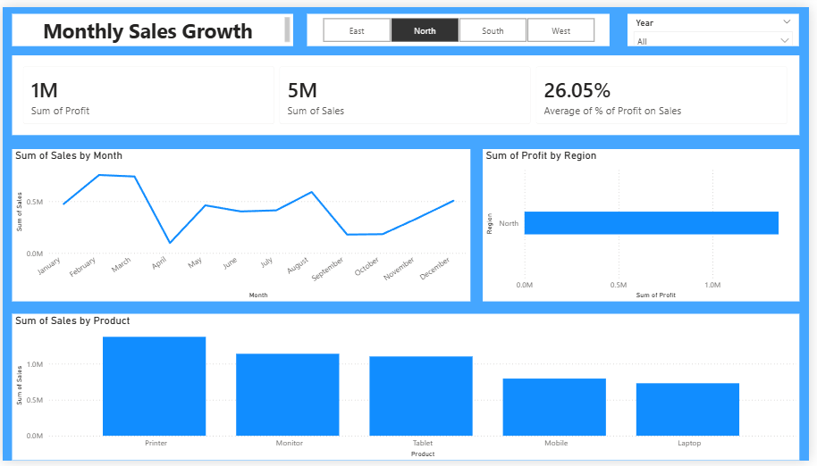

# 📊 End-to-End ETL Data Analytics Pipeline

## 📌 Project Overview
This project demonstrates a complete end-to-end data analytics workflow used in real-world business environments. The objective was to transform raw Excel data into meaningful insights using Python, SQL, and Power BI.

---

## ⚙️ Tech Stack
- Python (Pandas, NumPy)
- MySQL
- Power BI
- Microsoft Excel

---

## 🔄 Workflow

### 1. Data Extraction
- Raw dataset collected from Excel file
- Data contained missing values and inconsistencies

### 2. Data Cleaning & Transformation (Python)
- Removed null values and duplicates
- Standardized data formats
- Created new features such as revenue

### 3. Data Analysis (SQL)
- Performed aggregations using SQL queries
- Calculated KPIs like total sales, profit, and profit percentage
- Analyzed trends and performance across dimensions

### 4. Data Visualization (Power BI)
- Built an interactive dashboard for business insights
- Included filters for region and year
- Created charts for trend and performance analysis

---

## 📊 Dashboard Insights

- 💰 Total Sales: **5M**
- 💸 Total Profit: **1M**
- 📈 Profit Margin: **26.05%**

### Key Analysis:
- Monthly sales trend analysis
- Region-wise profit comparison
- Product-wise sales performance

---

## 📷 Dashboard Preview

---

## 🗄️ SQL Queries Included

The project includes SQL queries for:

- Total sales and profit calculation
- Monthly sales trend analysis
- Product-wise performance
- Region-wise profit analysis

File: `sql/queries.sql`

---

## 🚀 How to Run the Project

1. Run the Python script to clean data  
2. Execute SQL queries for analysis  
3. Open Power BI dashboard file (`.pbix`)  

---

## 🎯 Business Value

This dashboard helps in:
- Identifying top-performing products  
- Tracking monthly sales growth  
- Understanding regional profitability  
- Supporting data-driven decision making  

---

## 📌 Conclusion

This project showcases the integration of data cleaning, database querying, and visualization to solve real-world business problems using an end-to-end analytics approach.

---